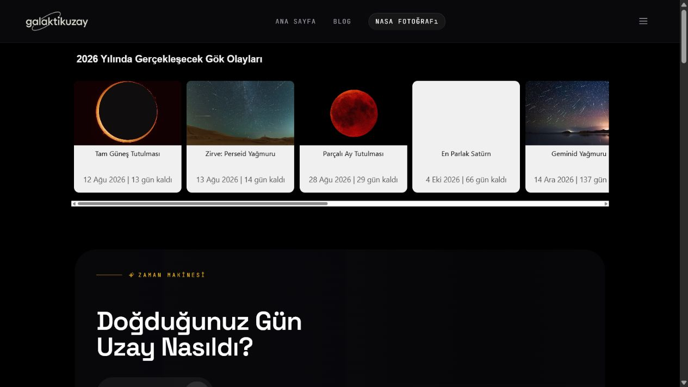
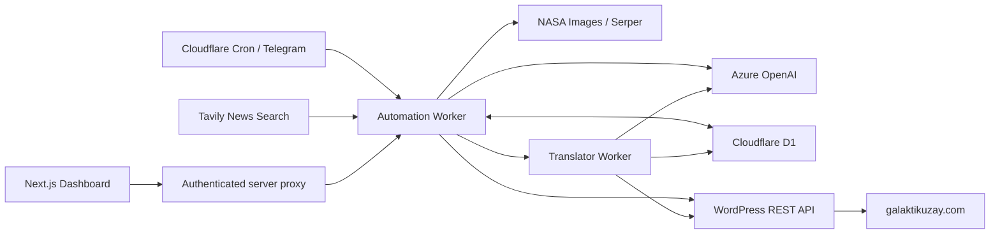

# Galaktik Uzay Automation

[](https://galaktikuzay.com/)
[](https://workers.cloudflare.com/)
[](https://www.typescriptlang.org/)
[](https://github.com/ozguradmin/galaktikuzay/actions/workflows/ci.yml)

Galaktik Uzay is a live multilingual astronomy platform backed by an automated
editorial pipeline. The system discovers recent space news, filters duplicate
or stale stories, selects a candidate, creates the source article in Turkish,
finds attributable images, and publishes linked English, German, Spanish,
French, and Dutch editions through a dedicated translation worker.

**Live product:** [galaktikuzay.com](https://galaktikuzay.com/)



## What the project currently does

- Searches recent astronomy and space-news sources through Tavily.
- Filters stale results and URLs already stored in Cloudflare D1.
- Uses Azure OpenAI for story selection and structured Turkish draft generation.
- Adds internal-link suggestions and WordPress-ready metadata.
- Searches NASA Images first, then uses Serper as a fallback.
- Uploads selected images and publishes posts or review drafts through the
  WordPress REST API.
- Uses a separate Cloudflare Worker to translate the Turkish source article
  into English, German, Spanish, French, and Dutch.
- Connects all six language editions through the site's Polylang bridge and
  stores each edition in D1 with its language code.
- Runs on a configurable publishing schedule with Cloudflare Workers cron.
- Sends operational updates through Telegram and can share published posts on X.
- Provides a Next.js dashboard for status, logs, scheduling, draft generation,
  and manual publishing.

The repository does **not** currently generate images or run a local model.
Those ideas are listed separately in the roadmap below.

## Open-source LLM evaluation toolkit

An independently licensed evaluation toolkit for comparing OpenAI-compatible
multilingual model endpoints is available under [`llm-eval/`](llm-eval/). It
supports structured-output, source-adherence, latency, token-usage, and cost
comparisons. The toolkit is separate from the current production publishing
pipeline; its scoped MIT license does not automatically apply to other parts of
this repository.

## Architecture



The dashboard does not expose Worker credentials to browser JavaScript.
Authentication is performed server-side with an environment-provided password,
an HMAC-signed HttpOnly session cookie, and a separate Worker API token.

## Repository layout

```text
.
├── automation/               # Hono + Cloudflare Worker publishing pipeline
│   ├── migrations/           # D1 schema
│   └── src/
│       ├── services/         # Search, generation, scheduling and publishers
│       ├── config/
│       └── index.ts
├── dashboard/                # Next.js operations dashboard
│   └── src/
│       ├── app/
│       ├── lib/
│       └── proxy.ts
├── translator/               # EN/DE/ES/FR/NL translation Worker
│   └── src/
└── docs/images/              # README product screenshots
```

## Technology

| Area | Current implementation |
| --- | --- |
| Runtime | Cloudflare Workers, Hono |
| Storage | Cloudflare D1 |
| Dashboard | Next.js 16, React 19 |
| AI | Azure OpenAI for Turkish generation and multilingual translation |
| Discovery | Tavily |
| Images | NASA Images API, Serper |
| Publishing | WordPress REST API, X API |
| Operations | Telegram Bot API, Workers cron |

## Local development

### Automation Worker

```bash
cd automation
npm ci
cp .dev.vars.example .dev.vars
npm run dev
```

Create the D1 database and apply the migration before the first run:

```bash
npm run db:migrate
```

Update the D1 binding and non-sensitive URLs in `wrangler.toml` for your own
Cloudflare account.

### Dashboard

```bash
cd dashboard
npm ci
cp .env.example .env.local
npm run dev
```

The dashboard expects:

- `BACKEND_API_URL`: Cloudflare Worker base URL.
- `DASHBOARD_API_TOKEN`: same random token configured on the Worker.
- `DASHBOARD_PASSWORD`: new administrator password.
- `DASHBOARD_SESSION_SECRET`: at least 32 random characters used to sign sessions.

### Translator Worker

```bash
cd translator
npm ci
cp .dev.vars.example .dev.vars
npm run dev
```

The automation Worker calls the translator through a Cloudflare service
binding. A Turkish source article is always created first; EN, DE, ES, FR, and
NL editions are then generated sequentially and linked as one Polylang group.

## Production secrets

Real credentials must never be committed. Worker credentials are configured
with `wrangler secret put`:

```bash
wrangler secret put AZURE_OPENAI_KEY
wrangler secret put AZURE_OPENAI_ENDPOINT
wrangler secret put TAVILY_API_KEY
wrangler secret put SERPER_API_KEY
wrangler secret put WP_APP_PASSWORD
wrangler secret put WP_USERNAME
wrangler secret put TELEGRAM_BOT_TOKEN
wrangler secret put TELEGRAM_CHAT_ID
wrangler secret put TWITTER_API_KEY
wrangler secret put TWITTER_API_SECRET
wrangler secret put TWITTER_ACCESS_TOKEN
wrangler secret put TWITTER_ACCESS_SECRET
wrangler secret put DASHBOARD_API_TOKEN
wrangler secret put CRON_SECRET
```

The Translator Worker uses its own copies of `AZURE_OPENAI_ENDPOINT`,
`AZURE_OPENAI_KEY`, `WP_USERNAME`, `WP_APP_PASSWORD`, and
`TELEGRAM_BOT_TOKEN`.

Use different random values for `DASHBOARD_API_TOKEN`, `CRON_SECRET`,
`DASHBOARD_PASSWORD`, and `DASHBOARD_SESSION_SECRET`.

## GPU and open-model roadmap

This section describes planned work, not functionality already present in the
production pipeline.

1. Deploy a quantized multilingual instruction model, initially
   Qwen2.5-14B-Instruct or Qwen3-14B, behind a serverless GPU endpoint.
2. Run it in shadow mode against the current Azure OpenAI story-selection and
   Turkish draft-generation stages.
3. Compare source adherence, Turkish editorial quality, JSON validity, latency,
   and cost on real draft workloads.
4. Route only the stages that meet the existing quality baseline to the open
   model, retaining a provider fallback.
5. Evaluate original image generation separately after the language pipeline;
   image generation is not part of the current product.

## Verification

```bash
cd automation
npm ci
npx tsc --noEmit

cd ../dashboard
npm ci
npm run lint
npm run build

cd ../translator
npm ci
npm run typecheck
npx wrangler deploy --dry-run
```

## Security

- `.env*`, `.dev.vars`, build output, and Wrangler state are ignored.
- Dashboard sessions are server-signed and stored in HttpOnly cookies.
- Dashboard-to-Worker calls use a server-side token.
- Cron authentication uses a dedicated secret rather than an AI provider key.
- Before publishing changes, scan both the working tree and Git history for
  accidental credentials.
